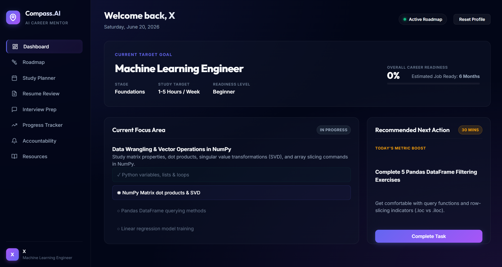

# 🚀 Career Compass AI – Personal Career Mentor


An AI-powered career guidance platform designed to help students and aspiring professionals navigate their learning journey with personalized roadmaps, study planning, progress tracking, interview preparation, and accountability coaching.

Built during the **Build with AI Bootcamp** using **Antigravity**.

---

# 📖 Project Overview

Career Compass AI acts as a personal AI mentor that helps users:

✅ Choose a career path

✅ Build personalized learning roadmaps

✅ Track learning progress

✅ Plan daily and weekly study schedules

✅ Prepare for interviews

✅ Stay accountable to career goals

✅ Discover curated learning resources

The platform is designed to transform career planning into a structured and actionable experience.

---

# ✨ Features

| Feature | Description |
|----------|-------------|
| 🎯 Career Roadmaps | Personalized learning paths based on career goals |
| 📊 Progress Tracking | Monitor career readiness and skill completion |
| 📅 Study Planner | Daily and weekly learning schedules |
| 📝 Resume Review | Resume improvement recommendations |
| 🎤 Interview Preparation | Technical and behavioral interview support |
| 🤝 Accountability Coach | Goal tracking and motivation |
| 📚 Resource Hub | Curated learning materials and recommendations |

---

# 📸 Screenshot

## Dashboard



---

# 🛠️ Tech Stack

## Frontend

| Technology | Purpose |
|------------|----------|
| HTML5 | Structure |
| CSS3 | Styling & Layout |
| JavaScript (ES6) | Functionality & Interactivity |

## Design

| Technology | Purpose |
|------------|----------|
| Glassmorphism UI | Modern visual design |
| Responsive Design | Mobile & Desktop compatibility |

## AI Development

| Technology | Purpose |
|------------|----------|
| Antigravity | AI-assisted development |
| Prompt Engineering | AI agent behavior design |

## Deployment

| Technology | Purpose |
|------------|----------|
| Netlify | Hosting and deployment |

## Version Control

| Technology | Purpose |
|------------|----------|
| GitHub | Source code management |

---

# 🚀 How to Use

### Step 1
Select your target career path.

Examples:
- Machine Learning Engineer
- AI Engineer
- Data Scientist
- Software Engineer

### Step 2
Choose your:
- Skill level
- Weekly study hours
- Learning preferences

### Step 3
Explore your personalized dashboard.

### Step 4
Follow the recommended learning roadmap.

### Step 5
Track your progress and complete suggested tasks.

### Step 6
Use interview preparation and resume review features to improve career readiness.

---

# 🌐 Live Demo

### 🔗 Demo Link

https://nimble-starship-01b436.netlify.app/

---

# 📂 Project Structure

```text
career-compass-ai/
│
├── index.html
├── style.css
├── app.js
│
├── images/
│   └── dashboard.png
│
└── README.md
```

---

# 🎓 Build with AI Bootcamp Project

This project was developed as part of the **Build with AI Bootcamp**.

### Key Concepts Explored

- AI Agent Design
- Prompt Engineering
- User Experience Design
- AI-Assisted Development
- Rapid Prototyping
- Web Deployment

---

# 🚀 Future Enhancements

- User Authentication
- Cloud-Based Progress Storage
- AI Resume Scoring
- Interactive Mock Interviews
- Learning Analytics Dashboard
- Advanced Career Readiness Assessment
- Personalized AI Recommendations

---

# 📚 Key Learnings

Through this project, I gained experience in:

- Building AI-powered applications
- Designing user-centric interfaces
- Creating personalized learning experiences
- Deploying production-ready web applications
- Leveraging AI tools for rapid development


---

⭐ If you found this project interesting, feel free to explore the live demo and share your feedback!
